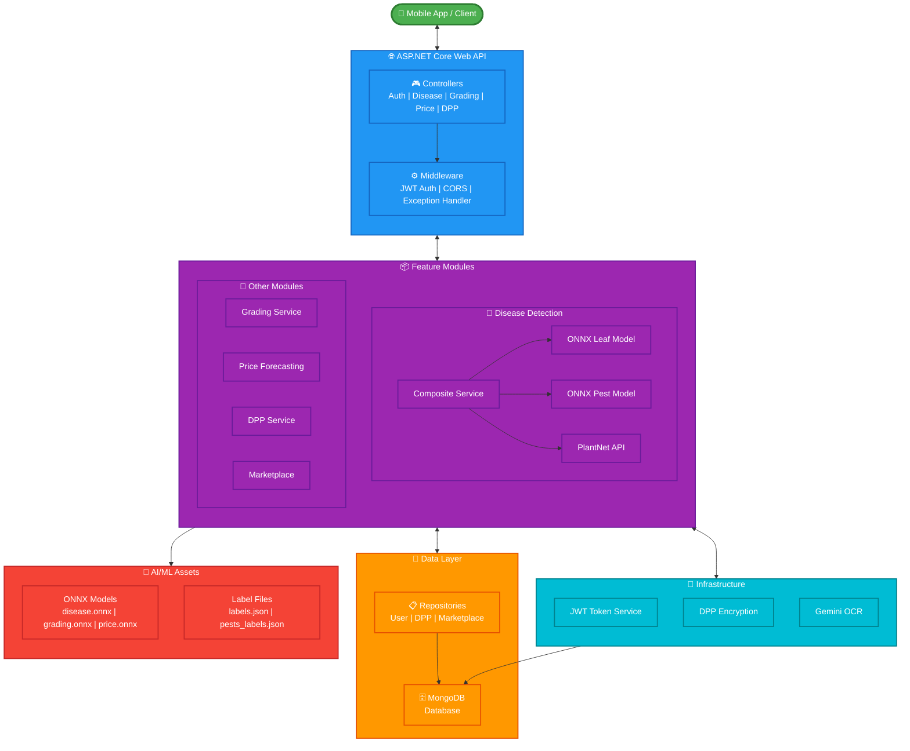

# Rubber Intelligence API 🌿🔌

The **Rubber Intelligence API** is a comprehensive ASP.NET Core 8.0 Web API backend that powers the Rubber Intelligence mobile application. Built with a modular architecture, it provides AI-powered services for disease detection, grading, price forecasting, and supply chain traceability using MongoDB and ONNX ML models.

## 🚀 Key Features

### 1. 🦠 Disease Detection AI & GPS Alerting System : IT22563750
- **ONNX Leaf Disease Detection**: Deep learning models for identifying rubber leaf diseases
- **Pest Detection**: Computer vision-based pest identification
- **PlantNet Integration**: Weed identification using external API
- **Composite Service**: Intelligent routing between detection strategies

### 2. 🍂 Rubber Grading System : IT22355928
- **ONNX-Based Grading**: ML model for automated rubber quality assessment
- **Standards Compliance**: Grades according to RSS (Ribbed Smoked Sheets) standards
- **Image Analysis**: Quality evaluation from rubber sheet images

### 3. 📈 Price Forecasting : IT22584090
- **ONNX Time Series Model**: Predictive analytics for rubber market prices
- **Historical Analysis**: Trend identification and pattern recognition
- **Market Insights**: Data-driven pricing recommendations

### 4. 🔗 Digital Product Passport (DPP) : IT22625298
- **End-to-End Traceability**: Track rubber from farm to export
- **OCR Integration**: Gemini API for document text extraction
- **Encryption**: Secure data handling with DPP encryption service
- **QR Code Generation**: Product identification and verification
- **Trading Platform**: Buy/sell rubber products
- **Product Listings**: Inventory management
- **Transaction Tracking**: Order and payment history

### 5. 🔐 Authentication & Authorization
- **JWT Token-Based Auth**: Secure stateless authentication
- **Role-Based Access Control**: Farmer, Admin, Buyer, Exporter, Researcher roles
- **Secure Storage**: Encrypted token management

## 🛠 Tech Stack

- **Framework**: [ASP.NET Core 8.0](https://dotnet.microsoft.com/apps/aspnet)
- **Language**: C# with .NET 8.0
- **Database**: [MongoDB](https://www.mongodb.com/) (NoSQL Document Store)
- **AI/ML Libraries**:
  - [ML.NET](https://dotnet.microsoft.com/apps/machinelearning-ai/ml-dotnet) - Image Analytics
  - [ONNX Runtime](https://onnxruntime.ai/) - Model Inference
  - [ImageSharp](https://sixlabors.com/products/imagesharp/) - Image Processing
- **Authentication**: JWT Bearer Tokens
- **API Documentation**: Swagger/OpenAPI
- **Configuration**: Environment Variables (.env support)

## 🏗 Architecture



## 📂 Project Structure

```
RubberIntelligence.Backend/
├── RubberIntelligence.API/          # Main Web API Project
│   ├── Controllers/                  # API Controllers
│   ├── Modules/                      # Feature Modules
│   │   ├── DiseaseDetection/         # Disease AI Module
│   │   │   ├── Services/             # Detection services
│   │   │   ├── Models/               # DTOs and domain models
│   │   │   └── Assets/               # ONNX models and labels
│   │   ├── Grading/                  # Grading Module
│   │   ├── PriceForecasting/         # Price Prediction Module
│   │   ├── Dpp/                      # Digital Product Passport
│   │   └── Marketplace/              # Trading Platform
│   ├── Data/                         # Database Layer
│   │   ├── AppDbContext.cs           # MongoDB context
│   │   ├── Repositories/             # Data repositories
│   │   └── Seed/                     # Database seeding
│   ├── Domain/                       # Domain Models/Entities
│   ├── Auth/                         # Authentication logic
│   ├── Infrastructure/               # Cross-cutting services
│   ├── Program.cs                    # Application entry point
│   └── appsettings.json              # Configuration
├── scripts/                          # ML Training Scripts
│   ├── train_rubber_disease_fastai.py
│   ├── train_pests_fastai.py
│   ├── train_price_model.py
│   └── convert_to_onnx.py
└── README.md                         # This file
```

## 🏁 Getting Started

### Prerequisites
- **.NET 8.0 SDK** ([Download](https://dotnet.microsoft.com/download))
- **MongoDB** (Local or [MongoDB Atlas](https://www.mongodb.com/cloud/atlas))
- **Visual Studio 2022** or **VS Code** (Optional)

### Installation

1.  **Clone the repository**:
    ```bash
    git clone <repository-url>
    cd RubberIntelligence.Backend
    ```

2.  **Navigate to API project**:
    ```bash
    cd RubberIntelligence.API
    ```

3.  **Create `.env` file** (copy from template):
    ```bash
    cp .env.example .env
    ```

4.  **Configure environment variables** in `.env`:
    ```env
    MONGODB_CONNECTION_STRING=mongodb://localhost:27017
    JWT_KEY=your-super-secret-jwt-key-here
    GEMINI_API_KEY=your-gemini-api-key-for-ocr
    ```

5.  **Restore dependencies**:
    ```bash
    dotnet restore
    ```

### Running the API

1.  **Start the development server**:
    ```bash
    dotnet run
    ```

2.  **Access Swagger UI**:
    - Open browser: `https://localhost:<port>/swagger`
    - Default port is shown in console output

3.  **Test endpoints**:
    - Use Swagger UI for interactive API testing
    - Or use tools like Postman/Thunder Client

### Running with Docker (Optional)

```bash
docker build -t rubber-intelligence-api .
docker run -p 5000:5000 --env-file .env rubber-intelligence-api
```

## 🔑 Environment Variables

| Variable                    | Description                   | Required   |
| --------------------------- | ----------------------------- | ---------- |
| `MONGODB_CONNECTION_STRING` | MongoDB connection string     | ✅ Yes      |
| `JWT_KEY`                   | Secret key for JWT signing    | ✅ Yes      |
| `GEMINI_API_KEY`            | Google Gemini API key for OCR | ⚠️ DPP Only |

## 📡 API Endpoints

### Authentication
- `POST /api/auth/register` - Register new user
- `POST /api/auth/login` - Login and get JWT token

### Disease Detection
- `POST /api/disease/detect` - Detect disease from image
- `GET /api/disease/history` - Get detection history

### Grading
- `POST /api/grading/grade` - Grade rubber sheet quality
- `GET /api/grading/history` - Get grading history

### Price Forecasting
- `POST /api/price/forecast` - Get price prediction
- `GET /api/price/history` - Historical price data

### DPP (Digital Product Passport)
- `POST /api/dpp/create` - Create new product passport
- `GET /api/dpp/{id}` - Get passport details
- `POST /api/dpp/scan` - Scan document with OCR

### Marketplace
- `GET /api/marketplace/products` - List all products
- `POST /api/marketplace/products` - Create product listing
- `GET /api/marketplace/products/{id}` - Get product details

## 🤖 ML Models

The API uses ONNX models for inference:
- **Disease Detection**: `leaf_disease_model.onnx`, `pest_detection_model.onnx`
- **Grading**: `rubber_grading_model.onnx`
- **Price Forecasting**: `price_forecast_model.onnx`

Training scripts are located in `/scripts` directory.

## 🤝 Contributing

Contributions are welcome! Please follow these steps:
1.  Fork the repository
2.  Create a feature branch (`git checkout -b feature/YourFeature`)
3.  Commit your changes
4.  Push to the branch
5.  Open a Pull Request

## 📄 License

This project is part of the Rubber Intelligence research initiative.

---
*Powering Smart Agriculture Through AI.*
