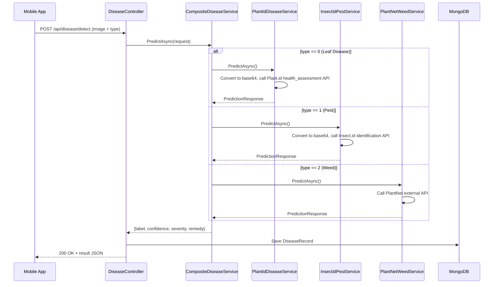

# Disease Detection Module — Backend

## Overview

The Disease Detection module allows rubber plantation users to identify **three categories of threats** by uploading a photo. The core novelty is the **Composite Strategy Pattern** — a single API endpoint delegates to three completely different AI backends based on the user's selection.

| #   | Detection Type   | Service                 | AI Approach                                                                                     |
| --- | ---------------- | ----------------------- | ----------------------------------------------------------------------------------------------- |
| 0   | **Leaf Disease** | `PlantIdDiseaseService` | [Plant.id](https://plant.id) Health Assessment API — 548+ conditions                            |
| 1   | **Pest**         | `InsectIdPestService`   | [Insect.id](https://insect.kindwise.com) Identification API — thousands of invertebrate species |
| 2   | **Weed**         | `PlantNetWeedService`   | External API ([PlantNet](https://my-api.plantnet.org))                                          |

## Architecture

```
IDiseaseDetectionService (interface)
├── CompositeDiseaseService  ← Registered as IDiseaseDetectionService (router)
│   ├── PlantIdDiseaseService     (type == 0) → Plant.id Health Assessment API
│   ├── InsectIdPestService       (type == 1) → Insect.id Identification API
│   └── PlantNetWeedService       (type == 2) → PlantNet external API
└── MockDiseaseService        ← For testing without API keys
```

## End-to-End Flow



## API Endpoints

Both endpoints require `[Authorize]` (JWT Bearer token).

| Endpoint                   | Method     | Description                                                                                         |
| -------------------------- | ---------- | --------------------------------------------------------------------------------------------------- |
| `POST /api/disease/detect` | Detect     | Accepts `multipart/form-data` with `Image` (file) + `Type` (enum 0/1/2). Returns prediction result. |
| `GET /api/disease/history` | GetHistory | Returns the last 20 detection records for the authenticated user.                                   |

### Request — `POST /api/disease/detect`

```
Content-Type: multipart/form-data

Image: <file>
Type: 0  (0=LeafDisease, 1=Pest, 2=Weed)
```

### Response

```json
{
  "label": "Anthracnose",
  "confidence": 0.94,
  "severity": "High",
  "remedy": "Prune infected parts. Apply copper-based fungicides. Improve air circulation."
}
```

## Folder Structure

```
DiseaseDetection/
├── Controllers/
│   └── DiseaseController.cs            # API endpoints (detect + history)
├── DTOs/
│   ├── PredictionDtos.cs               # PredictionRequest & PredictionResponse
│   └── ValidationDtos.cs               # Image quality & content validation DTOs
├── Enums/
│   └── DiseaseType.cs                  # LeafDisease=0, Pest=1, Weed=2
├── Models/
│   └── mobilenetv2.onnx                # MobileNetV2 for image content verification
├── Services/
│   ├── IDiseaseDetectionService.cs     # Interface
│   ├── CompositeDiseaseService.cs      # Strategy router
│   ├── PlantIdDiseaseService.cs        # Plant.id API — leaf disease detection (548+ conditions)
│   ├── InsectIdPestService.cs          # Insect.id API — pest identification
│   ├── PlantNetWeedService.cs          # PlantNet API — weed/plant identification
│   ├── ImageValidationService.cs       # Orchestrates quality + content checks
│   ├── ImageQualityService.cs          # Blur detection + resolution check
│   ├── ContentVerificationService.cs   # MobileNetV2 content pre-screening
│   ├── IImageValidationService.cs      # Validation interface
│   ├── MockDiseaseService.cs           # Mock for testing without APIs
│   ├── OnnxLeafDiseaseService.cs       # (Legacy) Custom ONNX model — kept as reference
│   └── OnnxPestDetectionService.cs     # (Legacy) Custom ONNX model — kept as reference
└── README.md
```

## Plant.id Leaf Disease Service

- Calls `POST https://plant.id/api/v3/health_assessment` with base64-encoded image
- Requires `PLANTID_API_KEY` environment variable
- Returns health assessment with disease name, probability, and severity
- Covers 548+ plant health conditions including diseases, pests, and abiotic issues
- Falls back to a mock response if the API key is missing

## Insect.id Pest Service

- Calls `POST https://insect.kindwise.com/api/v1/identification` with base64-encoded image
- Requires `INSECTID_API_KEY` environment variable
- Returns pest identification with species name, probability, and remedy
- Covers thousands of invertebrate species (insects, spiders, arthropods)
- Falls back to a mock response if the API key is missing

## PlantNet Weed Service

- Calls `https://my-api.plantnet.org/v2/identify/all` with the uploaded image
- Requires `PLANTNET_API_KEY` environment variable (or `PlantNet:ApiKey` in config)
- Returns top match with scientific + common name and confidence score
- Falls back to a mock response if the API key is missing

## Image Validation Pipeline

Before any image is sent to the AI services, it passes through:

1. **Quality Check** (`ImageQualityService`) — resolution ≥ 224×224, blur score ≥ threshold
2. **Content Verification** (`ContentVerificationService`) — MobileNetV2 pre-screening ensures image contains expected content type (leaf/pest/weed)

## Environment Variables

| Variable           | Required For          | Description                                                     |
| ------------------ | --------------------- | --------------------------------------------------------------- |
| `PLANTID_API_KEY`  | Leaf Disease (type=0) | API key from [admin.kindwise.com](https://admin.kindwise.com)   |
| `INSECTID_API_KEY` | Pest (type=1)         | API key from [admin.kindwise.com](https://admin.kindwise.com)   |
| `PLANTNET_API_KEY` | Weed (type=2)         | API key from [my-api.plantnet.org](https://my-api.plantnet.org) |

## Data Persistence

Each detection is saved as a `DiseaseRecord` in MongoDB with fields:
`Id`, `UserId`, `DiseaseType`, `PredictedLabel`, `Confidence`, `Timestamp`, `ImagePath`

## Rubber-Specific Customization

The system includes strict filtering to ensure only results relevant to rubber plantations are returned. Non-relevant detections are flagged with specific messages.

**Note:** The system maps both common names and scientific names (e.g., *Colletotrichum*, *Oidium*) to the standardized categories below.

### Allowed Leaf Diseases
- **Anthracnose_Type** (*Colletotrichum*, *Glomerella*)
- **Corynespora_Leaf_Fall** (*Corynespora cassiicola*)
- **Powdery_Mildew** (*Oidium heveae*, *Erysiphe*)
- **Phytophthora_Leaf_Blight** (*Phytophthora*, *Blight*)
- **Leaf_Spot_Group** (*Pestalotiopsis*, *Curvularia*, *Drechslera*, etc.)
- **Healthy**

### Allowed Pests
- **Rubber_Leaf_Skeletonizer** (Moth larvae, Caterpillars)
- **Rubber_Leafhopper** (*Cicadellidae*, *Jassid*, *Empoasca*)
- **Red_Spider_Mite** (*Tetranychus*, *Oligonychus*)
- **Thrips** (*Thysanoptera*)
- **Rubber_Mealybug** (*Pseudococcidae*, *Ferrisia*, *Paracoccus*)
- **Weevil** (*Curculionidae*, *Hypomeces*)

### Allowed Weeds
- **Imperata** (Cogon Grass)
- **Chromolaena** (Siam Weed)
- **Mikania** (Mile-a-minute)
- **Ageratum** (Billygoat Weed)
- **Axonopus** (Carpet Grass)
- **Panicum** (Guinea Grass)
- **Mimosa** (Sensitive Plant)

