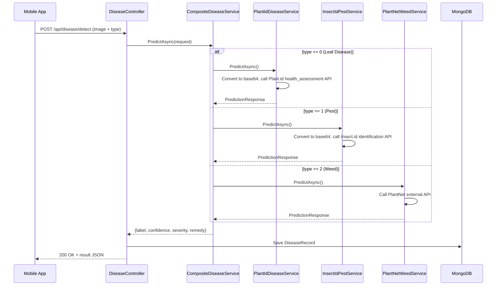

# Disease Detection Module — Backend

## Overview

The Disease Detection module allows rubber plantation users to identify **three categories of threats** by uploading a photo. The core novelty is the **Composite Strategy Pattern** — a single API endpoint delegates to three completely different AI backends based on the user's selection. **Output is restricted to trained classes only** via a centralized `AllowedClasses.cs` configuration.

| #   | Detection Type   | Service                 | AI Approach                                                                                     | Output Restricted To             |
| --- | ---------------- | ----------------------- | ----------------------------------------------------------------------------------------------- | -------------------------------- |
| 0   | **Leaf Disease** | `PlantIdDiseaseService` | [Plant.id](https://plant.id) Health Assessment API — 548+ conditions                            | 9 trained classes (ONNX labels)  |
| 1   | **Pest**         | `InsectIdPestService`   | [Insect.id](https://insect.kindwise.com) Identification API — thousands of invertebrate species | 19 trained classes (ONNX labels) |
| 2   | **Weed**         | `PlantNetWeedService`   | External API ([PlantNet](https://my-api.plantnet.org))                                          | No restriction                   |

## Architecture

```
IDiseaseDetectionService (interface)
├── CompositeDiseaseService  ← Registered as IDiseaseDetectionService (router + class restriction)
│   ├── PlantIdDiseaseService     (type == 0) → Plant.id API → AllowedClasses filter
│   ├── InsectIdPestService       (type == 1) → Insect.id API → AllowedClasses filter
│   ├── PlantNetWeedService       (type == 2) → PlantNet external API (no filter)
│   └── AllowedClasses            (static) — centralized trained class lists + label mapping
└── MockDiseaseService        ← For testing without API keys
```

## End-to-End Flow



## API Endpoints

Both endpoints require `[Authorize]` (JWT Bearer token).

| Endpoint                   | Method     | Description                                                                                         |
| -------------------------- | ---------- | --------------------------------------------------------------------------------------------------- |
| `POST /api/disease/detect` | Detect     | Accepts `multipart/form-data` with `Image` (file) + `Type` (enum 0/1/2). Returns prediction result. |
| `GET /api/disease/history` | GetHistory | Returns the last 20 detection records for the authenticated user.                                   |

### Request — `POST /api/disease/detect`

```
Content-Type: multipart/form-data

Image: <file>
Type: 0  (0=LeafDisease, 1=Pest, 2=Weed)
```

### Response

```json
{
  "label": "Anthracnose",
  "confidence": 0.94,
  "severity": "High",
  "remedy": "Prune infected parts. Apply copper-based fungicides. Improve air circulation."
}
```

## Folder Structure

```
DiseaseDetection/
├── Controllers/
│   ├── DiseaseController.cs            # API endpoints (detect + history + map-data)
│   └── AlertController.cs             # Proximity alert endpoints
├── DTOs/
│   ├── PredictionDtos.cs               # PredictionRequest & PredictionResponse
│   └── ValidationDtos.cs               # Image quality & content validation DTOs
├── Enums/
│   └── DiseaseType.cs                  # LeafDisease=0, Pest=1, Weed=2
├── Models/
│   ├── mobilenetv2.onnx                # ★ Pre-trained MobileNetV2 (ImageNet 1000 classes) — content verification
│   ├── rubber_leaf_disease_model.onnx  # ★ Custom-trained FastAI model — 9 rubber leaf disease classes
│   └── pests_model.onnx               # ★ Custom-trained FastAI model — 19 rubber pest classes
├── Services/
│   ├── IDiseaseDetectionService.cs     # Interface
│   ├── CompositeDiseaseService.cs      # Strategy router + class restriction post-processing
│   ├── AllowedClasses.cs              # ★ CENTRALIZED — trained class lists + label mapping
│   ├── PlantIdDiseaseService.cs        # Plant.id API — leaf disease detection
│   ├── InsectIdPestService.cs          # Insect.id API — pest identification
│   ├── PlantNetWeedService.cs          # PlantNet API — weed/plant identification
│   ├── ImageValidationService.cs       # Orchestrates quality + content checks
│   ├── ImageQualityService.cs          # Blur detection + resolution check
│   ├── ContentVerificationService.cs   # ★ Uses mobilenetv2.onnx for content pre-screening
│   ├── IImageValidationService.cs      # Validation interface
│   ├── MockDiseaseService.cs           # Mock for testing without APIs
│   ├── OnnxLeafDiseaseService.cs       # ★ Uses rubber_leaf_disease_model.onnx for leaf disease
│   ├── OnnxPestDetectionService.cs     # ★ Uses pests_model.onnx for pest detection
│   ├── OnnxWeedDetectionService.cs     # ★ Reuses rubber_leaf_disease_model.onnx for weed detection
│   ├── IAlertService.cs               # Alert interface
│   └── AlertService.cs                # Proximity alert generation (Haversine)
└── README.md
```

## ONNX Models

The module uses **three ONNX model files** located in `Models/`. Each serves a different purpose in the detection pipeline:

### 1. `mobilenetv2.onnx` — Image Content Verification

| Property | Value |
|----------|-------|
| **Used by** | `ContentVerificationService.cs` |
| **Purpose** | Pre-screens uploaded images to verify they contain the expected content type (leaf/pest/weed) **before** sending to AI classification services |
| **Model** | Pre-trained MobileNetV2 (ImageNet, 1000 classes) |
| **Input** | `1×3×224×224` tensor (NCHW), ImageNet-normalised (mean=[0.485, 0.456, 0.406], std=[0.229, 0.224, 0.225]) |
| **Output** | 1000 logits → Softmax → Top-10 predictions checked against curated index sets |
| **When used** | Every detection request, as Stage 2 of the image validation pipeline |
| **Fallback** | If model file is missing, content verification is **skipped** (graceful fallback — images pass through unverified) |

**How it works:**
1. Image is resized to 224×224 and normalised with ImageNet stats
2. MobileNetV2 inference produces logits for all 1000 ImageNet classes
3. Softmax converts logits to probabilities
4. Top-10 predicted classes are checked against curated index sets:
   - `PlantRelatedIndices` — for LeafDisease (type=0) and Weed (type=2) images
   - `PestRelatedIndices` — for Pest (type=1) images
5. If **none** of the top-10 predictions match the expected index set → image is **rejected** with a helpful message (e.g., "This image does not appear to contain a rubber leaf or plant")

---

### 2. `rubber_leaf_disease_model.onnx` — Leaf Disease & Weed Classification

| Property | Value |
|----------|-------|
| **Used by** | `OnnxLeafDiseaseService.cs` (leaf disease) **AND** `OnnxWeedDetectionService.cs` (weed detection) |
| **Purpose** | Custom-trained CNN model that classifies rubber leaf conditions into 9 classes |
| **Model** | FastAI-trained CNN, exported to ONNX format |
| **Input** | `1×3×224×224` tensor (NCHW), ImageNet-normalised |
| **Output** | 9 logits → Softmax → predicted class + confidence |
| **Confidence threshold** | 60% (below this → rejected as "Unrecognized") |

**9 Trained Classes (leaf diseases):**

| Index | Class Name | Description |
|-------|------------|-------------|
| 0 | `Anthracnose` | Fungal disease causing dark lesions on leaves |
| 1 | `Birds_eye` | Bacterial spots with a bird's-eye appearance |
| 2 | `Colletorichum` | Fungal pathogen causing leaf blight |
| 3 | `Corynespora` | Serious fungal leaf fall disease |
| 4 | `Dry_Leaf` | Drought stress or root rot symptoms |
| 5 | `Healthy` | No disease detected |
| 6 | `Leaf_Spot` | General fungal leaf spot disease |
| 7 | `Pesta` | Pest infestation visible on leaves |
| 8 | `Powdery_mildew` | White powdery fungal coating on leaves |

**Used by two services:**

- **`OnnxLeafDiseaseService`** (type=0) — Uses the model directly for leaf disease classification. Returns the predicted class label with remedy.
- **`OnnxWeedDetectionService`** (type=2) — **Reuses the same model** but remaps the output labels to weed-specific terminology via `MapToWeedResult()`. For example:
  - `Healthy` → `"Healthy Weed"` (with herbicide advice)
  - `Anthracnose` → `"Weed with Fungal Infection"` (with spread prevention advice)
  - `Pesta` → `"Pest-Affected Weed"` (with migration prevention advice)

---

### 3. `pests_model.onnx` — Pest Classification

| Property | Value |
|----------|-------|
| **Used by** | `OnnxPestDetectionService.cs` |
| **Purpose** | Custom-trained CNN model that classifies rubber plantation pests into 19 classes |
| **Model** | FastAI-trained CNN, exported to ONNX format |
| **Input** | `1×3×224×224` tensor (NCHW), ImageNet-normalised |
| **Output** | 19 logits → Softmax → predicted class + confidence |
| **Confidence threshold** | 55% (slightly lower than leaf model due to higher class count) |

**19 Trained Classes (pests):**

| Index | Class Name | Index | Class Name |
|-------|------------|-------|------------|
| 0 | `Adristyrannus` | 10 | `Mediterranean fruit fly` |
| 1 | `Aphids` | 11 | `Mites` |
| 2 | `Beetle` | 12 | `RedSpider` |
| 3 | `Bugs` | 13 | `Riptortus` |
| 4 | `Cabbage Looper` | 14 | `Slug` |
| 5 | `Cicadellidae` | 15 | `Snail` |
| 6 | `Cutworm` | 16 | `Thrips` |
| 7 | `Earwig` | 17 | `Weevil` |
| 8 | `FieldCricket` | 18 | `Whitefly` |
| 9 | `Grasshopper` | | |

---

### Model Usage Summary

```
Image Upload
    │
    ├─→ Stage 1: ImageQualityService (blur + resolution check)
    ├─→ Stage 2: ContentVerificationService ← uses mobilenetv2.onnx
    │
    └─→ Detection Service (depends on active configuration):
        │
        ├─ External API mode (current default):
        │   ├── PlantIdDiseaseService (type=0) → Plant.id API → AllowedClasses filter
        │   ├── InsectIdPestService   (type=1) → Insect.id API → AllowedClasses filter
        │   └── PlantNetWeedService   (type=2) → PlantNet API
        │
        └─ Local ONNX mode (alternative):
            ├── OnnxLeafDiseaseService (type=0)  ← uses rubber_leaf_disease_model.onnx
            ├── OnnxPestDetectionService (type=1) ← uses pests_model.onnx
            └── OnnxWeedDetectionService (type=2) ← uses rubber_leaf_disease_model.onnx (remapped labels)
```

> **Note:** The system currently uses external APIs as the primary detection services. The ONNX services (`OnnxLeafDiseaseService`, `OnnxPestDetectionService`, `OnnxWeedDetectionService`) are **alternative implementations** that can be swapped in via dependency injection to enable fully offline detection. The `mobilenetv2.onnx` model is **always used** for content verification regardless of which detection mode is active.

## Class Restriction Pipeline

After the external API returns a prediction, `CompositeDiseaseService` passes the label through `AllowedClasses.MapLabel()`:

1. **Exact match** — if the API label matches a trained class name (case-insensitive), it passes through
2. **Keyword mapping** — if the API label contains a known keyword (e.g. "colletotrichum" → `Colletorichum`), it maps to the trained class
3. **No match** — returned as `Unidentified` with `IsRejected = true`, which also **skips proximity alerts**

**To add or remove detectable classes, edit only `AllowedClasses.cs`.**

## Plant.id Leaf Disease Service

- Calls `POST https://plant.id/api/v3/health_assessment` with base64-encoded image
- Requires `PLANTID_API_KEY` environment variable
- Returns health assessment with disease name, probability, and severity
- Covers 548+ plant health conditions including diseases, pests, and abiotic issues
- Falls back to a mock response if the API key is missing

## Insect.id Pest Service

- Calls `POST https://insect.kindwise.com/api/v1/identification` with base64-encoded image
- Requires `INSECTID_API_KEY` environment variable
- Returns pest identification with species name, probability, and remedy
- Covers thousands of invertebrate species (insects, spiders, arthropods)
- Falls back to a mock response if the API key is missing

## PlantNet Weed Service

- Calls `https://my-api.plantnet.org/v2/identify/all` with the uploaded image
- Requires `PLANTNET_API_KEY` environment variable (or `PlantNet:ApiKey` in config)
- Returns top match with scientific + common name and confidence score
- Falls back to a mock response if the API key is missing

## Image Validation Pipeline

Before any image is sent to the AI services, it passes through:

1. **Quality Check** (`ImageQualityService`) — resolution ≥ 224×224, blur score ≥ threshold
2. **Content Verification** (`ContentVerificationService`) — MobileNetV2 pre-screening ensures image contains expected content type (leaf/pest/weed)

## Environment Variables

| Variable           | Required For          | Description                                                     |
| ------------------ | --------------------- | --------------------------------------------------------------- |
| `PLANTID_API_KEY`  | Leaf Disease (type=0) | API key from [admin.kindwise.com](https://admin.kindwise.com)   |
| `INSECTID_API_KEY` | Pest (type=1)         | API key from [admin.kindwise.com](https://admin.kindwise.com)   |
| `PLANTNET_API_KEY` | Weed (type=2)         | API key from [my-api.plantnet.org](https://my-api.plantnet.org) |

## Data Persistence

Each detection is saved as a `DiseaseRecord` in MongoDB with fields:
`Id`, `UserId`, `DiseaseType`, `PredictedLabel`, `Confidence`, `Timestamp`, `ImagePath`, `Location` (GeoJSON)

