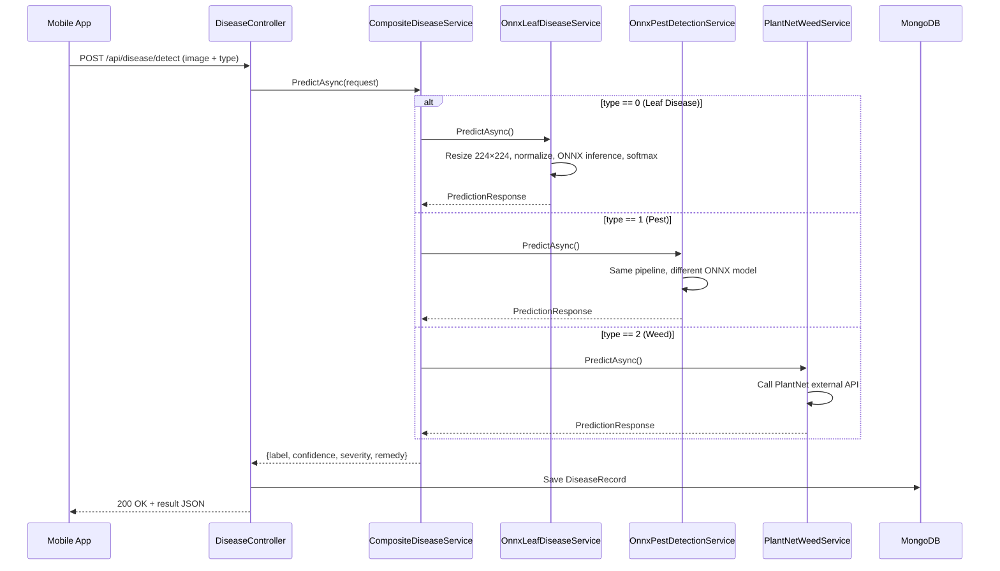

# Disease Detection Module — Backend

## Overview

The Disease Detection module allows rubber plantation users to identify **three categories of threats** by uploading a photo. The core novelty is the **Composite Strategy Pattern** — a single API endpoint delegates to three completely different AI backends based on the user's selection.

| # | Detection Type | Service | AI Approach |
|---|---|---|---|
| 0 | **Leaf Disease** | `OnnxLeafDiseaseService` | On-device ONNX model (FastAI ResNet) — 9 classes |
| 1 | **Pest** | `OnnxPestDetectionService` | On-device ONNX model — 19 pest classes |
| 2 | **Weed** | `PlantNetWeedService` | External API ([PlantNet](https://my-api.plantnet.org)) |

## Architecture

```
IDiseaseDetectionService (interface)
├── CompositeDiseaseService  ← Registered as IDiseaseDetectionService (router)
│   ├── OnnxLeafDiseaseService   (type == 0)
│   ├── OnnxPestDetectionService (type == 1)
│   └── PlantNetWeedService      (type == 2)
└── MockDiseaseService       ← For testing without models
```

## End-to-End Flow



## API Endpoints

Both endpoints require `[Authorize]` (JWT Bearer token).

| Endpoint | Method | Description |
|---|---|---|
| `POST /api/disease/detect` | Detect | Accepts `multipart/form-data` with `Image` (file) + `Type` (enum 0/1/2). Returns prediction result. |
| `GET /api/disease/history` | GetHistory | Returns the last 20 detection records for the authenticated user. |

### Request — `POST /api/disease/detect`

```
Content-Type: multipart/form-data

Image: <file>
Type: 0  (0=LeafDisease, 1=Pest, 2=Weed)
```

### Response

```json
{
  "label": "Anthracnose",
  "confidence": 0.94,
  "severity": "High",
  "remedy": "Prune infected parts. Apply copper-based fungicides. Improve air circulation."
}
```

## Folder Structure

```
DiseaseDetection/
├── Controllers/
│   └── DiseaseController.cs        # API endpoints (detect + history)
├── DTOs/
│   └── PredictionDtos.cs           # PredictionRequest & PredictionResponse
├── Enums/
│   └── DiseaseType.cs              # LeafDisease=0, Pest=1, Weed=2
├── Models/
│   ├── rubber_leaf_disease_model.onnx   # FastAI leaf disease model
│   └── pests_model.onnx                # FastAI pest detection model
├── Services/
│   ├── IDiseaseDetectionService.cs  # Interface
│   ├── CompositeDiseaseService.cs   # Strategy router
│   ├── OnnxLeafDiseaseService.cs    # Leaf disease ONNX inference (9 classes)
│   ├── OnnxPestDetectionService.cs  # Pest detection ONNX inference (19 classes)
│   ├── PlantNetWeedService.cs       # PlantNet external API integration
│   └── MockDiseaseService.cs        # Mock for testing
└── README.md
```

## ONNX Inference Pipeline

Both `OnnxLeafDiseaseService` and `OnnxPestDetectionService` share the same pipeline:

1. **Load model** at startup from `Models/*.onnx` via `Microsoft.ML.OnnxRuntime`
2. **Preprocess** — Resize to 224×224 using SixLabors.ImageSharp
3. **Normalize** — ImageNet mean `[0.485, 0.456, 0.406]` and std `[0.229, 0.224, 0.225]`
4. **Create tensor** — NCHW format `[1, 3, 224, 224]`
5. **Run inference** — `InferenceSession.Run()`
6. **Post-process** — Softmax on raw logits → argmax → label lookup
7. **Severity** — Confidence > 80% → "High", else "Medium"

### Leaf Disease Classes (9)

Anthracnose, Birds_eye, Colletorichum, Corynespora, Dry_Leaf, Healthy, Leaf_Spot, Pesta, Powdery_mildew

### Pest Classes (19)

Adristyrannus, Aphids, Beetle, Bugs, Cabbage Looper, Cicadellidae, Cutworm, Earwig, FieldCricket, Grasshopper, Mediterranean fruit fly, Mites, RedSpider, Riptortus, Slug, Snail, Thrips, Weevil, Whitefly

## PlantNet Weed Service

- Calls `https://my-api.plantnet.org/v2/identify/all` with the uploaded image
- Requires `PLANTNET_API_KEY` environment variable (or `PlantNet:ApiKey` in config)
- Returns top match with scientific + common name and confidence score
- Falls back to a mock response if the API key is missing

## Data Persistence

Each detection is saved as a `DiseaseRecord` in MongoDB with fields:
`Id`, `UserId`, `DiseaseType`, `PredictedLabel`, `Confidence`, `Timestamp`, `ImagePath`
